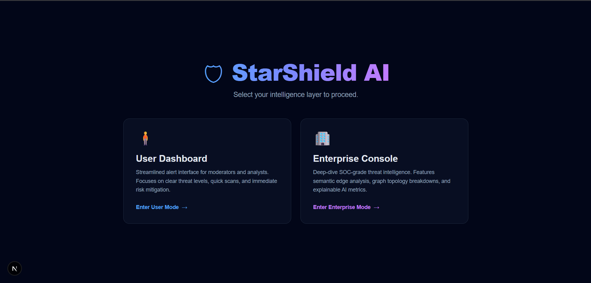
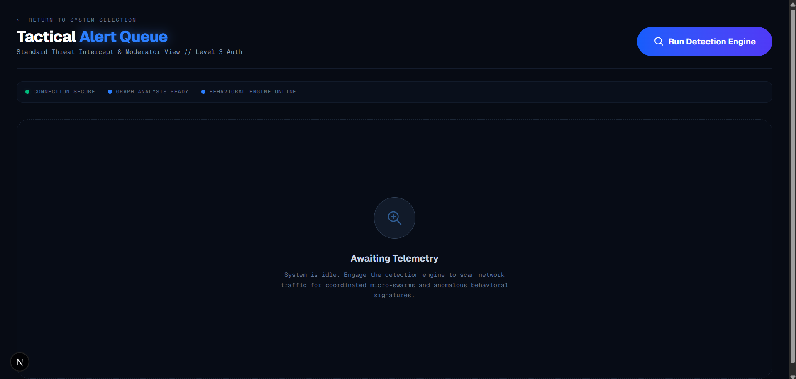
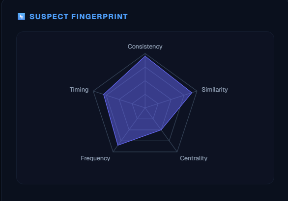
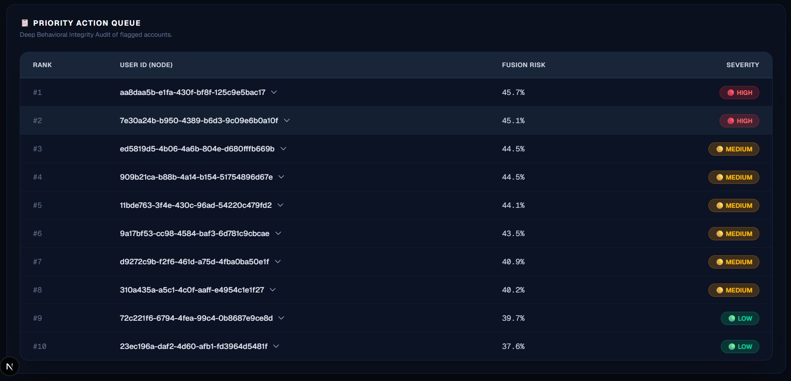
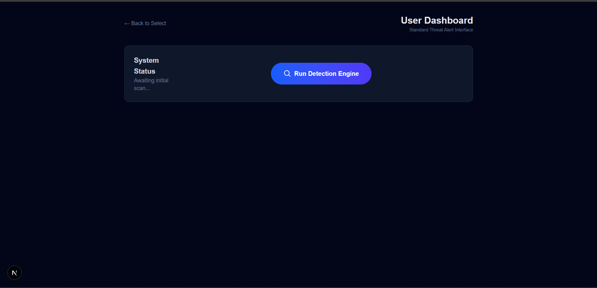

<div align="center">

# 🛡️ StarShield AI

### **Coordinated Micro-Swarm Bot Detection Engine**

<br/>


<br/>

> 🔍 An AI-powered detection system that identifies **low-volume, distributed, star-topology coordinated influence operations** that evade traditional spike-based detection — built with a multi-engine fusion architecture combining **Semantic Analysis**, **Behavioral Anomaly Detection**, and **Graph Topology Intelligence**.

<br/>

</div>

---

## 📸 Screenshots

<!-- 
  ╔══════════════════════════════════════════════════════════════════╗
  ║  📌 ADD YOUR SCREENSHOTS BELOW                                  ║
  ║                                                                  ║
  ║  Place your screenshot images in a /screenshots folder           ║
  ║  or use direct image URLs and uncomment the sections below.      ║
  ╚══════════════════════════════════════════════════════════════════╝
-->

<details>
<summary>🏠 <strong>Landing Page — System Selection</strong></summary>
<br/>



</details>

<details>
<summary>🏢 <strong>Enterprise Console — Full Tactical Dashboard</strong></summary>
<br/>



</details>

<details>
<summary>🕸️ <strong>Enterprise — Live Swarm Topology Graph</strong></summary>
<br/>

[Swarm Graph](screenshot/swarm-topology.png)

</details>

<details>
<summary>📊 <strong>Enterprise — Attack Wave Heatmap & Influence Velocity</strong></summary>
<br/>


</details>

<details>
<summary>🎯 <strong>Enterprise — Suspect Fingerprint Radar & Regional Clustering</strong></summary>
<br/>



</details>

<details>
<summary>📋 <strong>Enterprise — Priority Action Queue (Explainable AI)</strong></summary>
<br/>



</details>

<details>
<summary>🧍 <strong>User Dashboard — Moderator Alert Interface</strong></summary>
<br/>



</details>

---

## 🧠 What Problem Does StarShield Solve?

Traditional bot detection looks for **volume spikes** — sudden floods of identical messages. But modern coordinated influence operations have evolved:

```
❌ Old approach: Detect 1,000 identical tweets in 10 minutes
✅ StarShield:   Detect 1 hub + 10 bots posting paraphrased messages within 30 minutes
```

StarShield targets the **micro-swarm pattern** — a single "hub" account orchestrating ~10 bot accounts that amplify messages using **paraphrased content** within tight time windows. This star-topology pattern is invisible to volume-based detectors but detectable through combined semantic, behavioral, and graph analysis.

---

## 🏗️ System Architecture

```
┌─────────────────────────────────────────────────────────────────────────┐
│  🖥️  FRONTEND  (Next.js 16 · React 19 · Tailwind CSS 4 · TypeScript)  │
│  ┌──────────────┐  ┌──────────────────┐  ┌────────────────────────┐    │
│  │  🏠 Landing   │  │  🧍 User Dash    │  │  🏢 Enterprise Console │    │
│  │   page.tsx    │  │  /user           │  │  /enterprise           │    │
│  └──────────────┘  └──────────────────┘  └────────────────────────┘    │
│           │                 │                        │                   │
│           └─────────────────┴────────────────────────┘                   │
│                              ↓                                           │
│               📡 /api/run-detection (Next.js API Route)                 │
├─────────────────────────────────────────────────────────────────────────┤
│  ⚙️  BACKEND  (FastAPI · Python)                                        │
│  POST /run-detection → detection_service.py (Orchestrator)              │
├─────────────────────────────────────────────────────────────────────────┤
│  🧪  DETECTION ENGINE  (Multi-Engine Fusion Pipeline)                   │
│                                                                         │
│  ┌──────────────────┐  ┌──────────────────┐  ┌──────────────────┐      │
│  │  📝 Semantic      │  │  📈 Behavioral   │  │  🕸️ Graph        │      │
│  │  Engine           │  │  Engine           │  │  Engine           │      │
│  │                   │  │                   │  │                   │      │
│  │  Sentence-BERT    │  │  Isolation Forest │  │  NetworkX +       │      │
│  │  + FAISS Index    │  │  Anomaly Detect.  │  │  Louvain Comm.    │      │
│  └────────┬─────────┘  └────────┬─────────┘  └────────┬─────────┘      │
│           └──────────────────────┼──────────────────────┘                │
│                          ┌───────▼────────┐                              │
│                          │  🔀 Fusion      │     ┌───────────────────┐   │
│                          │  Engine         │────▶│  🛡️ Event Safety  │   │
│                          │  (60% G + 40% B)│     │  (FP Reducer)     │   │
│                          └────────────────┘     └───────────────────┘   │
├─────────────────────────────────────────────────────────────────────────┤
│  🗃️  DATASET GENERATOR  (Faker · NumPy · Pandas)                       │
│  Synthetic users + posts with injected micro-swarms & FP clusters       │
└─────────────────────────────────────────────────────────────────────────┘
```

---

## 📁 Full Project Structure

```
StarShield/
│
├── 📄 README.md                          # You are here
│
├── 🖥️ frontend/                           # Next.js 16 + React 19 Application
│   ├── app/
│   │   ├── layout.tsx                     # Root layout (Geist fonts, metadata)
│   │   ├── page.tsx                       # 🏠 Landing page — mode selection
│   │   ├── globals.css                    # Global styles + Tailwind imports
│   │   │
│   │   ├── enterprise/
│   │   │   └── page.tsx                   # 🏢 Enterprise SOC Console (5 graphs + table)
│   │   │
│   │   ├── user/
│   │   │   └── page.tsx                   # 🧍 User moderator dashboard (table only)
│   │   │
│   │   ├── api/
│   │   │   └── run-detection/
│   │   │       └── route.ts               # 📡 API proxy → FastAPI backend
│   │   │
│   │   └── components/
│   │       ├── SwarmGraph.tsx             # 🕸️ D3.js force-directed network graph
│   │       ├── BehavioralRadar.tsx        # 🎯 Recharts radar/spider chart
│   │       ├── PropagationTimeline.tsx    # 📈 Recharts area chart (influence velocity)
│   │       ├── RiskHeatmap.tsx            # 🔥 Recharts bar chart (attack waves)
│   │       ├── GeoCoordination.tsx        # 🌍 Recharts donut chart (regional clusters)
│   │       ├── EnterpriseRiskTable.tsx    # 📋 Expandable table with Explainable AI
│   │       ├── UserRiskTable.tsx          # 📋 Simplified moderator alert table
│   │       ├── RiskTable.tsx              # 📋 General-purpose risk table
│   │       ├── Controls.tsx               # 🔘 "Run Detection Engine" button
│   │       └── ClientOnly.tsx             # 🔒 SSR hydration guard wrapper
│   │
│   ├── lib/
│   │   └── api.ts                         # 🔌 API client (runDetection function)
│   │
│   ├── public/                            # Static assets
│   ├── package.json                       # Dependencies & scripts
│   ├── next.config.ts                     # Next.js configuration
│   ├── tailwind.config.ts                 # Tailwind CSS configuration
│   ├── tsconfig.json                      # TypeScript configuration
│   ├── postcss.config.mjs                 # PostCSS configuration
│   └── eslint.config.mjs                  # ESLint configuration
│
├── ⚙️ backend/                             # FastAPI Backend Server
│   ├── main.py                            # 🚀 FastAPI app entry (health + detection endpoints)
│   ├── schemas.py                         # 📐 Pydantic models (SuspiciousUser, DetectionResponse)
│   ├── requirements.txt                   # 📦 Python dependencies
│   ├── vercel.json                        # ▲ Vercel deployment config
│   ├── __init__.py
│   └── services/
│       ├── detection_service.py           # 🎯 Orchestrator — runs all engines & builds response
│       └── __init__.py
│
├── 🧪 detection_engine/                   # Core AI Detection Pipeline
│   ├── semantic_engine.py                 # 📝 Sentence-BERT + FAISS similarity detection
│   ├── behavioral_engine.py              # 📈 Isolation Forest anomaly detection
│   ├── graph_engine.py                   # 🕸️ NetworkX + Louvain star-topology detection
│   ├── fusion.py                         # 🔀 Multi-engine score fusion (weighted)
│   ├── event_safety.py                   # 🛡️ False positive reduction (event burst safety)
│   ├── run_pipeline.py                   # ▶️ Standalone CLI pipeline runner
│   └── __init__.py
│
└── 🗃️ dataset_generator/                  # Synthetic Data Generation
    ├── generate_dataset.py                # 🏭 Data generator (organic + swarm injection)
    ├── users.csv                          # 👤 Generated user profiles (600 users)
    └── posts.csv                          # 💬 Generated posts with injected swarms
```

---

## 📊 Visualizations & Dashboards

StarShield provides **two intelligence layers** — a full-featured **Enterprise SOC Console** and a streamlined **User Moderator Dashboard** — serving different operational needs from the same detection backend.

---

### 🏢 Enterprise Console — Tactical Threat Intelligence

> **Route:** `/enterprise` · **5 Interactive Graphs + 1 Expandable Table** · **1600px layout**

The enterprise console is a military/SOC-grade tactical interface designed for security operations centers. It features a dark cybersecurity aesthetic with numbered tactical labels, glowing accents, and staggered fade-in animations.

<table>
<tr>
<td width="50%">

#### 1️⃣ Live Swarm Topology
**Type:** Force-Directed Network Graph  
**Library:** D3.js v7  
**What it shows:**
- Interactive node-link diagram of the entire user network
- 🔴 **Red nodes** (larger) = High-risk hub accounts
- 🔵 **Indigo nodes** (smaller) = Standard accounts
- Lines represent detected coordination links
- **Interactive:** Zoom, pan, drag nodes in real-time
- Physics simulation with collision detection

</td>
<td width="50%">

#### 4️⃣ Suspect Fingerprint
**Type:** Radar / Spider Chart  
**Library:** Recharts  
**What it shows:**
- 5-axis behavioral profile of the top suspect
- **Consistency** — posting pattern regularity
- **Similarity** — semantic overlap with swarm
- **Centrality** — graph topology importance
- **Frequency** — message posting rate
- **Timing** — temporal coordination score
- Indigo fill with 50% opacity

</td>
</tr>
<tr>
<td>

#### 2️⃣ Attack Wave Heatmap
**Type:** Vertical Bar Chart  
**Library:** Recharts  
**What it shows:**
- Risk intensity distribution across time-of-day
- 🔴 **Red bars** = High-risk hours (risk > 70%)
- 🔵 **Indigo bars** = Normal activity hours
- Identifies peak coordination windows
- Rounded-top bar design

</td>
<td>

#### 3️⃣ Influence Velocity
**Type:** Gradient Area Chart  
**Library:** Recharts  
**What it shows:**
- Exponential spread of influence over time
- Plots reach from 10 → 12,000 across time intervals
- Red gradient fill (top to bottom fade)
- Monotone curve interpolation
- Visualizes how fast misinformation propagates

</td>
</tr>
<tr>
<td>

#### 5️⃣ Regional Clustering
**Type:** Donut / Pie Chart  
**Library:** Recharts  
**What it shows:**
- Geographic distribution of coordinated activity
- Segments: Asia, Europe, North America
- Indigo color family with padding between segments
- Identifies regions with concentrated bot activity

</td>
<td>

#### 📋 Priority Action Queue
**Type:** Interactive Expandable Table  
**Library:** React  
**What it shows:**
- Ranked list of all flagged users by fusion risk score
- Severity badges: 🔴 HIGH (≥45%) · 🟡 MEDIUM (≥40%) · 🟢 LOW (<40%)
- **Expandable rows** with Explainable AI breakdown:
  - Semantic Similarity score
  - Behavioral Anomaly level
  - Graph Centrality rating
  - Event Burst Safety assessment

</td>
</tr>
</table>

---

### 🧍 User Dashboard — Moderator Alert Interface

> **Route:** `/user` · **1 Simplified Alert Table** · **896px centered layout**

The user dashboard is intentionally minimal — designed for content moderators who need quick, actionable threat alerts without information overload.

| Component | Description |
|-----------|-------------|
| **🔔 System Status Banner** | Shows last scan time, connection status, and a "Run Detection Engine" button |
| **📋 Latest Threat Alerts Table** | 3-column table: Alert Priority (#1, #2...), Node ID, Status Badge (HIGH/MEDIUM/LOW). No percentages, no expandable rows — just clear, actionable alerts. |
| **🧹 Clear Results** | One-click reset to clear the alert queue |

---

## 🧪 Detection Engine — How It Works

StarShield uses a **multi-engine fusion architecture** where three independent detection engines analyze different dimensions of user behavior, and their outputs are combined for robust threat scoring.

### ⚙️ Pipeline Flow

```
CSV Data (users + posts)
    │
    ├──▶ 📝 Semantic Engine
    │       ├─ Encode posts → Sentence-BERT embeddings (all-MiniLM-L6-v2)
    │       ├─ Build FAISS inner-product index
    │       ├─ Find top-5 nearest neighbors per post
    │       └─ Filter: similarity ≥ 0.85 AND posted within 30 minutes
    │       Output: (user_A, user_B, similarity_score) edge pairs
    │
    ├──▶ 📈 Behavioral Engine
    │       ├─ Extract per-user features:
    │       │    • Mean posting interval
    │       │    • Variance of posting intervals
    │       │    • Mean active hour
    │       └─ Fit Isolation Forest (contamination = 0.08)
    │       Output: anomaly_score per user
    │
    └──▶ 🕸️ Graph Engine
            ├─ Build NetworkX graph from semantic edges
            ├─ Compute: degree centrality, betweenness centrality, clustering coefficient
            ├─ Run Louvain community detection
            └─ Star-topology scoring:
                 score = 0.5×degree + 0.3×(1-clustering) + 0.2×(1/(avg_neighbor_degree+1))
            Output: star_score per user

                    ↓

            🔀 Fusion Engine
            risk_score = 0.6 × graph_score + 0.4 × behavioral_score

                    ↓

            🛡️ Event Burst Safety Checker
            IF (distinct_users ≥ 15 AND time_spread ≥ 90min AND max_degree ≤ 0.15):
                → Real organic event detected → scores × 0.4 (60% reduction)

                    ↓

            📊 Final ranked list of suspicious users with explainable reasons
```

### 🔑 Key Algorithms & Techniques

| Engine | Technique | Purpose |
|--------|-----------|---------|
| **Semantic** | Sentence-BERT (`all-MiniLM-L6-v2`) | Encode post content into dense vector embeddings |
| **Semantic** | FAISS (Inner Product Index) | Fast approximate nearest-neighbor similarity search |
| **Semantic** | Temporal Co-occurrence Filter | Ensure similar posts are within 30-min coordination window |
| **Behavioral** | Isolation Forest | Unsupervised anomaly detection on posting behavior patterns |
| **Graph** | NetworkX + Louvain | Community detection and graph topology metrics |
| **Graph** | Custom Star-Topology Scorer | Detect hub-and-spoke bot network patterns |
| **Fusion** | Weighted Linear Combination | Merge graph (60%) + behavioral (40%) scores |
| **Safety** | Event Burst Checker | Reduce false positives from organic real-world events |

---

## 🗃️ Synthetic Dataset

The dataset generator creates realistic test data with ground-truth labels for validation:

| Data | Count | Description |
|------|-------|-------------|
| **Total Users** | 600 | Mix of organic and bot accounts |
| **Organic Users** | ~556 | Pareto-distributed followers, old accounts, 3-8 random posts each |
| **Micro-Swarms** | 4 swarms × 11 | 1 hub + 10 bots per swarm (44 bot accounts total) |
| **Swarm Behavior** | — | Hub posts base message → bots post paraphrased versions within 2-10 min |
| **False Positive Clusters** | Injected | Organic users discussing same topic with wider timing (0-180 min) |
| **Paraphrasing** | Synonym substitution | 60% probability per keyword to simulate real paraphrasing |

---

## 🚀 Getting Started

### Prerequisites

- 🐍 **Python 3.11+**
- 📦 **Node.js 18+** and **npm**
- 💻 Git

### 1. Clone the Repository

```bash
git clone https://github.com/your-username/StarShield.git
cd StarShield
```

### 2. Backend Setup

```bash
# Navigate to backend
cd backend

# Create virtual environment
python -m venv venv

# Activate virtual environment
# Windows:
venv\Scripts\activate
# macOS/Linux:
source venv/bin/activate

# Install dependencies
pip install -r requirements.txt

# Start the FastAPI server
uvicorn main:app --reload --port 8000
```

### 3. Generate Synthetic Data (Optional)

```bash
cd dataset_generator
python generate_dataset.py
```

This creates `users.csv` and `posts.csv` with injected micro-swarms.

### 4. Frontend Setup

```bash
# Navigate to frontend
cd frontend

# Install dependencies
npm install

# Start the development server
npm run dev
```

### 5. Open the Application

Navigate to **http://localhost:3000** in your browser.  
Choose between 🧍 **User Dashboard** or 🏢 **Enterprise Console** and hit **"Run Detection Engine"**.

---

## 🛠️ Tech Stack

<table>
<tr>
<th>Layer</th>
<th>Technology</th>
<th>Version</th>
<th>Purpose</th>
</tr>
<tr>
<td rowspan="5"><strong>🖥️ Frontend</strong></td>
<td>Next.js</td><td>16</td><td>React framework with App Router & API routes</td>
</tr>
<tr><td>React</td><td>19</td><td>UI component library</td></tr>
<tr><td>Tailwind CSS</td><td>4</td><td>Utility-first styling</td></tr>
<tr><td>D3.js</td><td>7</td><td>Force-directed swarm topology graph</td></tr>
<tr><td>Recharts</td><td>3</td><td>Radar, area, bar, and donut charts</td></tr>
<tr>
<td rowspan="2"><strong>⚙️ Backend</strong></td>
<td>FastAPI</td><td>—</td><td>High-performance Python API framework</td>
</tr>
<tr><td>Uvicorn</td><td>—</td><td>ASGI server</td></tr>
<tr>
<td rowspan="6"><strong>🧪 AI/ML</strong></td>
<td>Sentence-Transformers</td><td>—</td><td>SBERT embeddings (all-MiniLM-L6-v2)</td>
</tr>
<tr><td>FAISS (CPU)</td><td>—</td><td>Approximate nearest-neighbor search</td></tr>
<tr><td>scikit-learn</td><td>—</td><td>Isolation Forest anomaly detection</td></tr>
<tr><td>NetworkX</td><td>—</td><td>Graph construction & centrality metrics</td></tr>
<tr><td>python-louvain</td><td>—</td><td>Community detection algorithm</td></tr>
<tr><td>NumPy & Pandas</td><td>—</td><td>Data manipulation & feature extraction</td></tr>
<tr>
<td><strong>🗃️ Data</strong></td>
<td>Faker</td><td>—</td><td>Synthetic dataset generation</td>
</tr>
</table>

---

## 🎨 UI Design Language

| Element | Design Choice |
|---------|---------------|
| **Theme** | Dark-mode cybersecurity / SOC-grade aesthetic |
| **Backgrounds** | Near-black (`#070b14`) with frosted-glass panels |
| **Typography** | Geist Sans (body) · Geist Mono (labels, data) |
| **Accents** | Blue-Indigo gradient (primary) · Red (danger) · Emerald (safe) · Amber (warning) |
| **Animation** | Staggered fade-ins, pulsing status dots, hover glows |
| **Layout** | Enterprise: 12-col grid, 1600px · User: single-col, 896px |

---

## 📡 API Reference

### `GET /health`
Health check endpoint.

**Response:**
```json
{ "status": "ok" }
```

### `POST /run-detection`
Triggers the full detection pipeline.

**Response:**
```json
{
  "top_suspicious_users": [
    {
      "user_id": "user_123",
      "risk_score": 0.472,
      "reasons": {
        "semantic": "High",
        "behavioral": "Medium",
        "graph_centrality": "Very High",
        "event_safety": "Passed"
      }
    }
  ],
  "graph_data": {
    "nodes": [{ "id": "user_123", "group": 1, "influence": 85.3 }],
    "links": [{ "source": "user_123", "target": "user_456", "weight": 0.92 }]
  },
  "stats": {
    "total_users_analyzed": 600,
    "threats_detected": 12,
    "swarm_clusters": 4
  }
}
```

---

## 🤝 Contributing

1. Fork the repository
2. Create your feature branch: `git checkout -b feature/amazing-feature`
3. Commit your changes: `git commit -m 'Add amazing feature'`
4. Push to the branch: `git push origin feature/amazing-feature`
5. Open a Pull Request

---

## 📄 License

This project is open-source and available under the [MIT License](LICENSE).

---

<div align="center">

**Built with 🧠 AI + 🔒 Security + 💻 Engineering**

*StarShield AI — Detecting what traditional systems can't see.*

</div>
